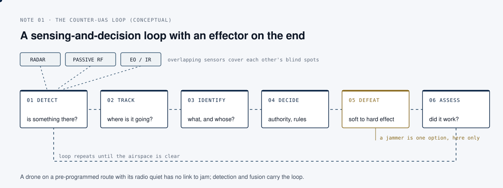

# Reading a small-drone threat, and why layered defence beats a jammer

*Counter-UAS · field research note 01*

## The question

When people first meet the counter-drone problem, they almost always ask the same thing: "which jammer should we buy?" It is the wrong question, and understanding why is the fastest way to show you have thought about the problem rather than read a product page.

## What the public sources say

The US Joint Interagency Task Force 401 publishes a *Counter-Small Unmanned Aircraft Systems Quick Reference Guide*, cleared for open publication. Two things in it are worth internalising.

**First, drones are categorised by weight, altitude and speed, not by menace.** The standard US Department of Defense framework sorts unmanned aircraft into five groups by maximum gross take-off weight, normal operating altitude and airspeed:

| Group | Take-off weight | Operating altitude | Airspeed |
| --- | --- | --- | --- |
| 1 | 0 to 20 lb | under 1,200 ft AGL | under 100 kt |
| 2 | 21 to 55 lb | under 3,500 ft AGL | under 250 kt |
| 3 | under 1,320 lb | under 18,000 ft MSL | under 250 kt |
| 4 | over 1,320 lb | under 18,000 ft MSL | any |
| 5 | over 1,320 lb | over 18,000 ft MSL | any |

If an aircraft has any attribute from a higher group, it falls into that higher group. The small, cheap, hard-to-see threat lives in Groups 1 and 2. It is defined by being light, low and slow, which is precisely what makes it hard to detect.

**Second, the threat is a mission set, not a device.** The same guide lists what a small drone is actually used for: intelligence and reconnaissance, acting as a communications relay, adjusting or delivering fires, one-way attack with an integrated warhead, simple harassment of airspace, and swarming, where many drones coordinate as one. A jammer addresses none of these directly. It addresses the *link*, and only if the link is there to attack.

## The analysis

A counter-drone response is a loop, not a gadget: detect, track, identify, decide, defeat, assess. A jammer is one option inside the "defeat" stage.

  

It is also the option most likely to be useless against the threats that matter, because:

- A drone flying a pre-programmed route on satellite navigation or inertial guidance, with its radio quiet, has no link to jam.
- Jamming radiates. It can interfere with friendly communications and navigation, which is why the same guide notes that electromagnetic mitigation must be deconflicted with the wider electronic-warfare picture. In many countries, civil use of jammers is also illegal outside specific authorities. Turning on a jammer near a civil airport is a very different act from turning one on inside a military perimeter.
- Detection is the hard part, and a jammer does none of it. The published fixed-site and rapidly-deployable defence systems in the guide pair several sensors (radar, a passive RF sensor, and an electro-optical / infrared camera) feeding a single picture, precisely because no one sensor sees a small drone reliably.

That is the case for **layered defence**: overlapping sensors that cover each other's blind spots, feeding one operator picture, with a graduated set of responses from soft to hard, chosen under clear authority.

## Why it matters

If you buy a jammer, you have bought a partial answer to the "defeat" stage of a six-stage problem, and quite possibly a new liability. If you buy the loop (detection and fusion first, decision and authority in the middle, effectors last) you have bought something that works against the drone flying dark and stands up to review afterwards.

The one-line version: **counter-UAS is not a jammer, it is a sensing-and-decision problem with an effector on the end.**

## Limitations

The loop is a conceptual model; real systems merge or split stages differently. The UAS group table is a US classification; other frameworks (for example NATO's class I to III) draw lines differently.

## Sources

- Joint Interagency Task Force 401, *Counter-Small Unmanned Aircraft Systems (C-sUAS) Quick Reference Guide*, Version 4, 2026. Cleared for open publication (Department of War, Office of Prepublication and Security Review, 26-P-1236).
- US Department of Defense UAS group definitions, as published in the unmanned systems roadmaps and Army UAS doctrine.
