# Attacking navigation: GNSS jamming versus spoofing

*Security · field research note 03*

## The question

Most small drones, and a great deal else, depend on satellite navigation. Those signals arrive at the ground extraordinarily weak (the GPS L1 C/A specification guarantees only about -158.5 dBW at the Earth's surface, below the thermal noise floor, recovered by correlation), which makes them both easy to drown out and possible to imitate. Two attacks exploit this, and confusing them is a reliable sign that someone has not done the work. What is the difference, and how do you defend against each?

*Everything below is conceptual and defensive, at the level of publicly documented principles. It describes how these effects work and how to counter them, not how to build one. Transmitting on GNSS frequencies without authority is illegal in most countries.*

## The two attacks

  

**Jamming is denial.** The attacker raises the noise in the receiver's band until the faint satellite signals can no longer be tracked. In signal terms, jamming drives the carrier-to-noise density (C/N0) below the receiver's tracking threshold. The important consequence: **the receiver knows it has lost navigation.** The system can react: hold position, fall back to inertial or visual navigation, or return home.

**Spoofing is deception.** The attacker transmits counterfeit satellite signals, typically slightly stronger than the real ones, crafted so the receiver computes a false position or time. The important consequence: **the receiver usually does not know it is wrong.** The vehicle flies confidently on a false position. This is the more dangerous of the two, precisely because there is no obvious failure to react to.

| | Jamming | Spoofing |
| --- | --- | --- |
| Mechanism | Overpower with noise | Counterfeit the signal |
| Effect | Loss of lock (denial) | False position or time (deception) |
| Does the target know? | Yes | No, usually |
| Harder to detect? | No | Yes |

## Defending against both

The defences are layered, and none is a single silver bullet:

- **Do not depend on the signal alone.** Inertial navigation and vision-based navigation need no external radio, so a vehicle that can hold its course without satellites is far harder to deny or deceive. Inertial solutions drift over time, so this buys minutes to hours rather than immunity. This is why "GNSS-denied performance" is such a meaningful axis when comparing platforms.
- **Protect the antenna.** A controlled-reception-pattern antenna (CRPA) is an array that steers nulls toward the direction of interference, suppressing a jammer or a single-direction spoofer while keeping real satellites in view.
- **Sanity-check the fix.** A position that jumps, a clock that drifts, signals that all arrive from one direction, or a signal that is suspiciously strong are detectable tells of spoofing when the receiver is designed to look for them. Authenticated signals, such as Galileo's Open Service Navigation Message Authentication (OSNMA), make counterfeit navigation data harder to pass off.
- **Cross-check.** Agreement between satellite, inertial and visual estimates is hard to fake across all three at once.

## Why it matters

The distinction is not academic. If your threat is jamming, resilience means graceful fallback: the system notices and copes. If your threat is spoofing, resilience means *detection and cross-checking*, because the system will otherwise be confidently, quietly wrong. Buying anti-jam protection and assuming you are also anti-spoof is a common and expensive mistake.

The one-line version: **jamming makes the receiver lost; spoofing makes it lied to. Defend accordingly.**

## Limitations

The figure is conceptual and not to scale. Real receivers degrade gradually, and sophisticated spoofing can be combined with jamming (jam first, then capture the re-acquiring receiver).

## Sources

- Satellite-navigation vulnerability to interference and the jamming-versus-spoofing distinction are widely documented in public GNSS and resilient-PNT literature (for example US Department of Homeland Security resilient-PNT material and academic research).
- GPS Interface Specification IS-GPS-200, minimum received L1 C/A signal power.
- European GNSS Service Centre, Galileo OSNMA public documentation.
- Controlled-reception-pattern antennas and inertial / visual navigation are standard, publicly described mitigations.
