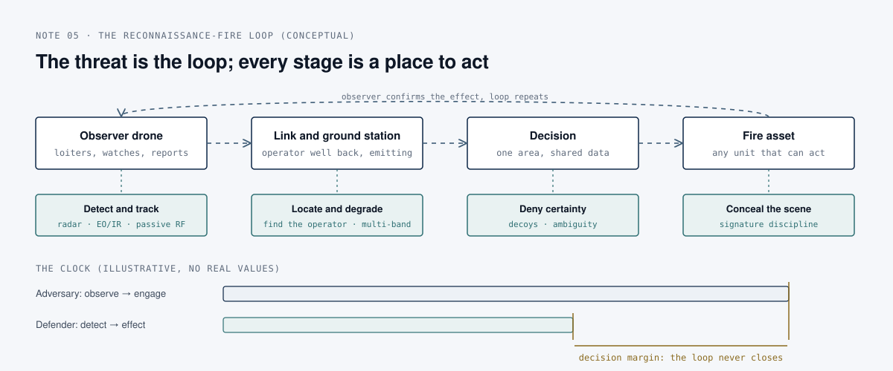

# Reading an adversary's drone textbook: defend the loop's clock, not the airframe

*Counter-UAS · field research note 05*

## The question

Counter-drone programmes are usually specified from the airframe up: size, speed, radar cross-section, control band. What changes if we start instead from how the other side trains its people to use drones? A recently published Russian military-vocational textbook on drone reconnaissance and fire support offers a rare, openly sold view of that training.

## What the source says

The book is V. I. Litvinenko, *Bespilotniki: razvedka, taktika, porazhenie* (*Drones: reconnaissance, tactics, engagement*), KNORUS, Moscow. Its edition data describe it as a teaching aid for cadets and students, written by a colonel and professor in a missile-forces and artillery department, with a reviewer from the General Staff Academy. It is a commercially published textbook, not a leaked document. This note was written from an unofficial machine translation of the Russian edition; the translation is rough, so only the author's main lines of argument are used here, in paraphrase.

Five points stand out for a defender.

**1. The drone replaced the spotter, and the reason given is time and risk.** The author compares drones with reconnaissance helicopters used to adjust artillery. Helicopter crews could not stay over the target safely, so, in his account, most targets ended up engaged without anyone observing the result. A drone removes the crew risk, can stay on station, and lets the operator watch both the target and the effect (chapter 2).

**2. There are layers of drones, matched to echelons.** Small hand-launched systems with short endurance and two or three crew serve battalions in the near tactical zone. Catapult-launched systems with endurance of ten hours or more and larger crews serve brigades and divisions deeper. Commercial quadcopters at platoon and company level observe several kilometres into the opposing position, up to about ten depending on the model (chapters 2 and 4).

**3. The author is candid about weaknesses.** He lists weather limits (heavy rain, fog, strong wind), fragility, the low autonomy of the smallest classes, dependence on satellite navigation combined with inertial sensors, and control and data links that are poorly protected and highly exposed to interference (chapter 2).

**4. The organisational change matters more than the aircraft.** The drone crew is described as a unit in its own right within the order of battle. The book argues for a single area of responsibility for reconnaissance and engagement, so that data from any observer reaches whichever fire asset can act, and so that the time between first observation and engagement shrinks. It describes passing a target to a higher echelon when the local unit cannot engage it, and sharing one observer's data with several dispersed fire assets under one command (chapter 4).

**5. It anticipates the defence.** Strike work is described as using more than one crew on different frequencies, and the closing chapters look ahead to drones that operate without any link, which the author presents as beyond the reach of electronic warfare (chapters 4 and 5).

## The analysis

Read as a whole, the book is less about aircraft than about a **reconnaissance-fire loop**: an observer, a link, a decision point and a fire asset, organised so that the loop closes as fast as possible. That reframes the defender's problem.

  

**The target is the loop, and every stage is a place to act.** The observer can be detected and tracked; its ground station, which in this doctrine sits well back but still emits, can be located; the link can be degraded; the scene the observer is looking at can be concealed or made ambiguous. Defeating the airframe is only one of these options, and not always the cheapest. This is the same conclusion as [note 01](01-c-uas-layered-defence.md), reached from the other side.

**Time is the currency on both sides.** The doctrine's stated aim is to shorten the time from first observation to engagement. The defender's corresponding measure is how long an observer can stay over an asset before it is detected and dealt with. If that dwell time is shorter than the adversary's loop, the loop does not close. Treating this as a decision-margin problem, loop time minus own detect-to-effect time, is the subject of the [c2-decision-latency](https://github.com/darkanalytica1/c2-decision-latency) toolkit.

**Observers loiter, and loitering is detectable.** An aircraft whose job is to watch has to stay in view for minutes, at a height and standoff set by its sensor. That is the best case for detection. Sensor siting should give persistent coverage of the approaches and standoff distances observers will use, not only of the asset's perimeter; the [c-uas-coverage-planner](https://github.com/darkanalytica1/c-uas-coverage-planner) makes that trade explicit.

**Single-band defeat is already priced in.** A doctrine that plans for several crews on different frequencies, and looks forward to link-free drones, has assumed that a jammer on one band will be met. Detection that does not depend on the link (radar, electro-optical and infrared), plus passive RF work aimed at locating operators while they still need a link, remains useful as autonomy grows.

**The observer is hunting signatures.** Much of the book's reconnaissance material concerns the signs that give a target away. The defender's mirror image is signature discipline: emission control, concealment, movement discipline and decoys, all of which lengthen the adversary's loop without firing a shot.

## Why it matters

Specifying counter-UAS from the airframe leads to buying an effector. Specifying it from the adversary's loop leads to detection, location and concealment first, and to a measurable objective: keep the observer's undetected dwell time shorter than the time the other side needs to act on it.

The one-line version: **defend against the loop's clock, not the drone's airframe.**

## Limitations

- One author, one textbook. It is prescriptive (how the author wants cadets to think), not a measured description of practice, and its claims about combat experience are the author's.
- Read through a poor machine translation. Figures and technical parameters in the book were not used, because they could not be checked against the original edition.
- The chapters on artillery fire adjustment were deliberately left out. This note describes the structure of the loop at the level needed to defend against it, not how to operate it.
- The diagram is conceptual and depicts no real system, unit or incident.

## Sources

- V. I. Litvinenko, *Bespilotniki: razvedka, taktika, porazhenie* (*Drones: reconnaissance, tactics, engagement*), teaching aid, KNORUS, Moscow; edition data give ISBN 978-5-406-16862-2 and an imprint dated 2027. Read via an unofficial English machine translation of the Russian edition.
- Joint Interagency Task Force 401, *Counter-Small Unmanned Aircraft Systems (C-sUAS) Quick Reference Guide*, Version 4, 2026, for the mission-set framing used in note 01.
