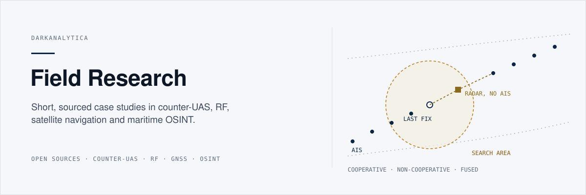

  

# Field Research

## What this is

Five short, original case studies in counter-drone defence, radio engineering, satellite-navigation security and maritime open-source intelligence. Each note takes one question, reads what the public sources actually say, and turns it into a plain-language assessment with its limits stated. They are independent research notes written only from open, cited sources.

## Why it matters

The same analytical habit runs through all five: no single sensor or source is enough, and the object worth attention is the one that does not agree with itself. A jammer without detection, a band read without context, a satellite fix nobody cross-checks, an AIS picture taken at face value; each is a decision made on one layer. These notes show how to reason across layers, which is the everyday work of anyone buying, building or operating sensing systems.

  

## Notes

| # | Case study | Field | Figure |
| --- | --- | --- | --- |
| 01 | [Reading a small-drone threat, and why layered defence beats a jammer](01-c-uas-layered-defence.md) | Counter-UAS | [The counter-UAS loop](assets/diagrams/c-uas-loop.svg) |
| 02 | [Frequency is destiny: reading a drone from its control band](02-rf-control-band.md) | RF engineering | Table of bands |
| 03 | [Attacking navigation: GNSS jamming versus spoofing](03-gnss-jamming-vs-spoofing.md) | Security | [Jamming versus spoofing](assets/diagrams/gnss-jamming-vs-spoofing.svg) |
| 04 | [Finding the ship running dark: fusing AIS with other open signals](04-osint-ais-dark-vessel.md) | OSINT / maritime | [AIS dark-gap fusion](assets/diagrams/ais-dark-gap.svg) |
| 05 | [Reading an adversary's drone textbook: defend the loop's clock, not the airframe](05-reading-adversary-drone-doctrine.md) | Counter-UAS / doctrine | [The reconnaissance-fire loop](assets/diagrams/recon-fire-loop.svg) |

## Method

Each note follows the same short shape:

1. **The question**, stated in one or two sentences.
2. **What the public sources say**, with the source named next to the claim.
3. **The analysis**, in plain language, separating what is established from what is inferred.
4. **Why it matters**, operationally, ending in a one-line summary.
5. **Limitations**, stated explicitly.

One idea per note, no unsourced figures, no hype.

## Limitations and assumptions

- These are introductions for practitioners, not engineering or legal references. Frequency allocations, drone classifications and maritime rules vary by country and change; verify against the primary source before relying on them.
- Diagrams are conceptual or illustrative. None depicts a real incident, vessel, site or system.
- Security material stays at the level of publicly documented principles and is written for defence and understanding. Nothing here describes how to build or operate a jammer or spoofer.

## Sources policy

Only public, openly published material is used: government and intergovernmental publications cleared for release (for example the JIATF-401 C-sUAS Quick Reference Guide, ITU and IMO instruments), public technical specifications, standard engineering texts, and commercially published books, which are summarised in paraphrase rather than reproduced. Each note lists its sources at the end. No proprietary, classified, client or employer material is used or implied.

## License

Text and figures released under [CC BY 4.0](https://creativecommons.org/licenses/by/4.0/). See [LICENSE](LICENSE). Cited sources belong to their authors.
